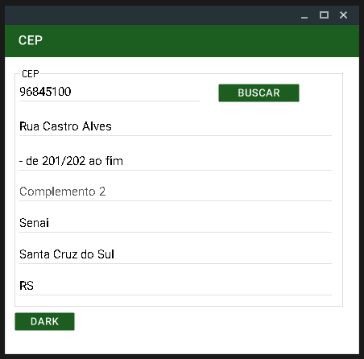

# Buscador de CEP

### Linguagens do projeto:

* C#

### Pacote e Referencia Instalados:

* Pacote do NuGet = Material Skin
* WebService dos Correios. Clique [Aqui](https://apps.correios.com.br/SigepMasterJPA/AtendeClienteService/AtendeCliente?wsdl)

### Requisitos:

* Uma IDE que funcione Windows Forms e componentes de C#
* Recomendo = Visual Studio 2022

#### Imagem Final

